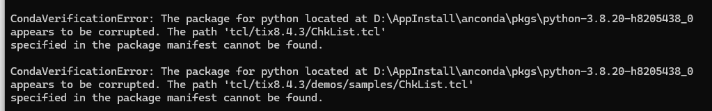

```py
conda clean --all
conda install python=3.8.20
#下载虚拟环境
conda create -n yolo5 python=3.8
#移除虚拟环境
conda env remove --name yolo5
#下载依赖文件
pip install -r requirements
#GPU加速
pip3 install torch torchvision torchaudio --index-url https://download.pytorch.org/whl/cu121
#torchvision  installed torchvision-0.19.1+cu121
pip install torchvision-2.2.0+cu121-cp38-cp38m-win_amd64.whl

#导出onnx模型
pip install onnx
pip install coremltools
```

出现下面这种问题，删除目录就行：



直接下载y

- 注意CUDA的版本是否对应

- 然后讲numpy的错误都改掉就行

- 看torchvision和torch的版本==都需要有cu121==

  ```
  pip show torch 
  pip show torchvision
  ```

  

